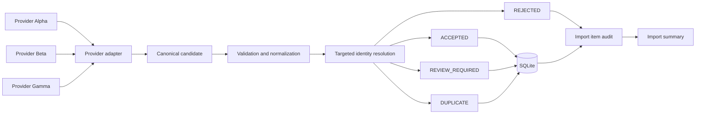

# Reliable Data Intake Pipeline

A small FastAPI intake boundary that turns inconsistent provider JSON into trusted canonical records. It demonstrates deterministic normalization, conservative identity resolution, replay safety, explicit review decisions, and transactionally consistent SQLite persistence.

[](https://github.com/vantablade-ai/reliable-data-intake-pipeline/actions/workflows/ci.yml)

## Why this exists

External systems use different field names and shapes, resend events, and provide incomplete or conflicting identity data. This service isolates that variation at the boundary and ensures every item is accepted, reviewed, rejected, or identified as a duplicate with a safe audit trail.

## Architecture



## Reliability invariants

- Replayed source records and known entity duplicates cannot create duplicate canonical state.
- An idempotency key cannot silently represent a different provider request.
- Ambiguous identity is routed for review and never silently merged.
- Rejected input never becomes canonical state.
- Provider-specific schemas end at adapter boundaries.
- Failed processing rolls back canonical and import-item changes.
- Failed jobs remain inspectable, and HTTP errors do not reveal database internals.

## 60-second demo

```bash
git clone https://github.com/vantablade-ai/reliable-data-intake-pipeline.git
cd reliable-data-intake-pipeline
make install
make demo
```

The demo uses a temporary SQLite database, no credentials, and no running server. Its concise output includes:

```text
[ACCEPTED] Alpha record
[DUPLICATE] Beta matched normalized email
[REVIEW_REQUIRED] Gamma missing_email
[REJECTED] Alpha invalid_email
[REPLAY] same request reused safely
[409] changed request rejected for reused idempotency key
```

## API

Start the local server with `make run`, then visit `/docs` for OpenAPI documentation.

| Method | Path | Purpose |
| --- | --- | --- |
| `POST` | `/ingest/{provider}` | Ingest one record or a bounded batch |
| `GET` | `/records` | List canonical records, optionally filter with `?status=ACCEPTED` |
| `GET` | `/records/{id}` | Fetch one record |
| `GET` | `/reviews` | List review records |
| `GET` | `/imports/{id}` | Inspect an import summary and its item decisions |
| `GET` | `/health` | Local health response |

Supported providers are `provider_alpha`, `provider_beta`, and `provider_gamma`. The API accepts one JSON object, a JSON list, or `{"records": [...]}`. The batch limit defaults to 100 records and can be changed with `MAX_BATCH_SIZE`. Send an optional `Idempotency-Key` header (up to 200 characters) to safely replay a request.

## Provider shapes

Alpha uses `record_id`, `email`, `first_name`, `last_name`, and `company`. Beta uses `contactId`, `contactEmail`, `fullName`, and `organization`. Gamma uses `ref`, `mail`, `name`, and `org`. Each adapter maps its schema into a shared `ProviderCandidate`; raw request payloads are not persisted.

## Identity and deduplication

Source replay is checked by `(source, source_record_id)`. Cross-provider matching checks normalized email, then exact normalized first name, last name, and company. Exact full name/company without email on either record is a duplicate. Conflicting emails for the same full identity and partial overlap across at least two identity components require review. There is no fuzzy or probabilistic matching.

A SHA-256 fingerprint is stored for sufficiently complete identity, with a database uniqueness constraint as a final safeguard. It is an identity key, not a credential.

## Idempotency

The request fingerprint hashes a stable JSON serialization of provider and payload. Object key ordering does not affect the hash. Repeating a key with the same semantic JSON request returns the original import with HTTP 200 and `idempotent_replay=true`; changing either provider or payload returns HTTP 409. Only the hash is stored for this behavior.

## Transaction semantics

The import job is committed first so it is observable. One SQLite transaction then contains canonical inserts, item audit rows, and final status/count updates. If processing fails, that transaction rolls back; the job is marked `failed` in a separate transaction and the API returns a controlled 503. SQLite is the runtime database. The relational design uses conventional constraints and can inform a PostgreSQL implementation, but PostgreSQL is not run here.

## Failure behavior

| Situation | Behavior |
| --- | --- |
| malformed JSON | 422 |
| unsupported provider | 422 |
| invalid envelope | 422 |
| invalid individual record | `REJECTED` |
| incomplete but processable identity | `REVIEW_REQUIRED` |
| ambiguous/conflicting identity | `REVIEW_REQUIRED` |
| duplicate source/entity | `DUPLICATE` |
| idempotency key reused with same request | original result replayed (200) |
| idempotency key reused with different request | 409 |
| oversized batch | 413 |
| missing resource | 404 |
| persistence failure | rollback + import `FAILED` + 503 |

## Testing

`make test` runs the offline test suite against temporary SQLite files using in-process ASGI transport. `make check` runs Ruff, Python compilation, and pytest. CI runs the same lint, compile, and test commands on Python 3.11.

## Engineering decisions

- Deterministic mappings and validation keep behavior explainable and testable.
- Targeted indexed lookups avoid full canonical-table scans during identity resolution.
- The service interprets identity evidence; the repository provides bounded query methods.
- Rejected items retain safe reason codes without retaining raw payloads.
- Explicit outcomes make uncertainty visible instead of silently guessing.

## Repository structure

```text
app/adapters/       provider-specific JSON mapping
app/repositories/   SQLite queries and transaction boundary
app/services/       normalization, identity resolution, ingestion workflow
app/main.py         FastAPI routes and HTTP error contract
schema.sql          relational tables, constraints, and indexes
tests/              isolated service and API behavior checks
scripts/demo.py     deterministic temporary-database demonstration
```

## Running locally

```bash
python -m venv .venv
source .venv/bin/activate
make install
make run
```

The default database is `data/intake.db`; set `DATABASE_PATH` to choose another local path. `make demo` always uses a temporary database that is removed on exit.

## Limitations

This is a synthetic local proof artifact with no client data, external credentials, or real provider integrations. It does not include authentication, authorization, rate limiting, background queues, migrations, production operations, or a human review application. Source events are treated as immutable; reconciliation of later corrections is outside scope. SQLite is used at runtime, and PostgreSQL compatibility has not been executed or claimed.
